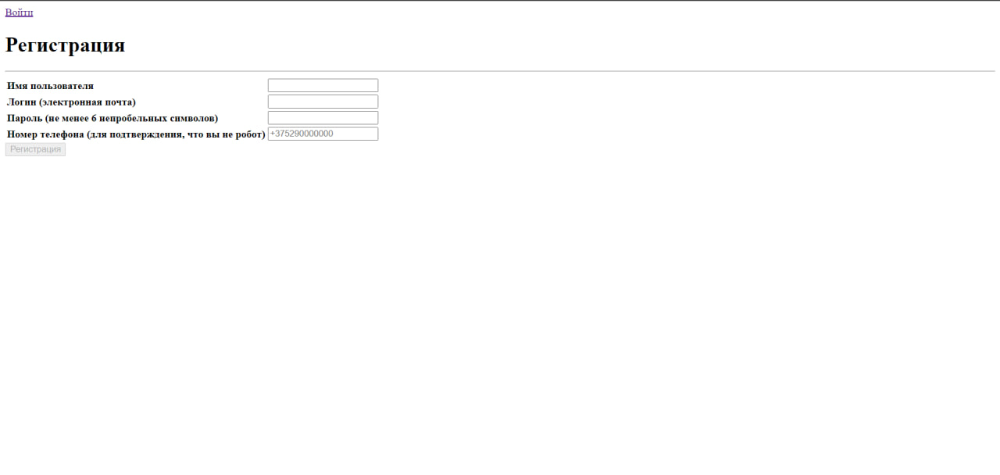
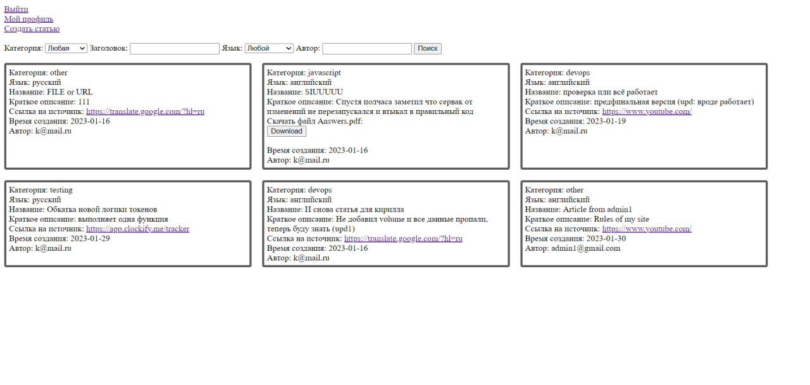
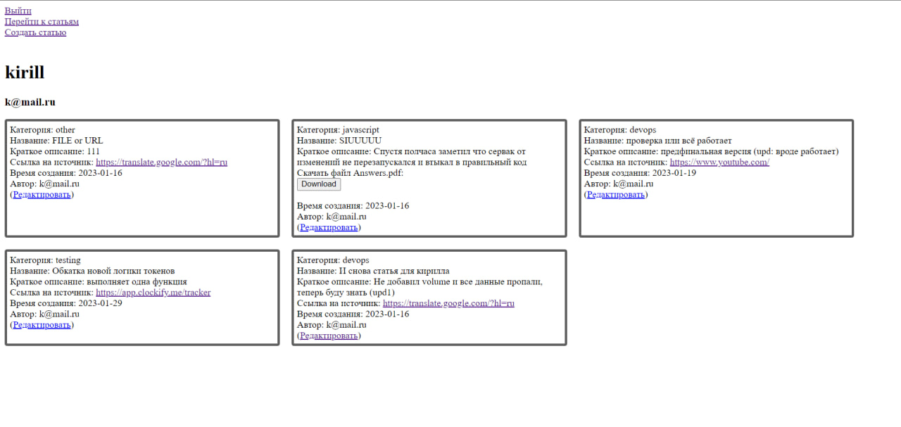
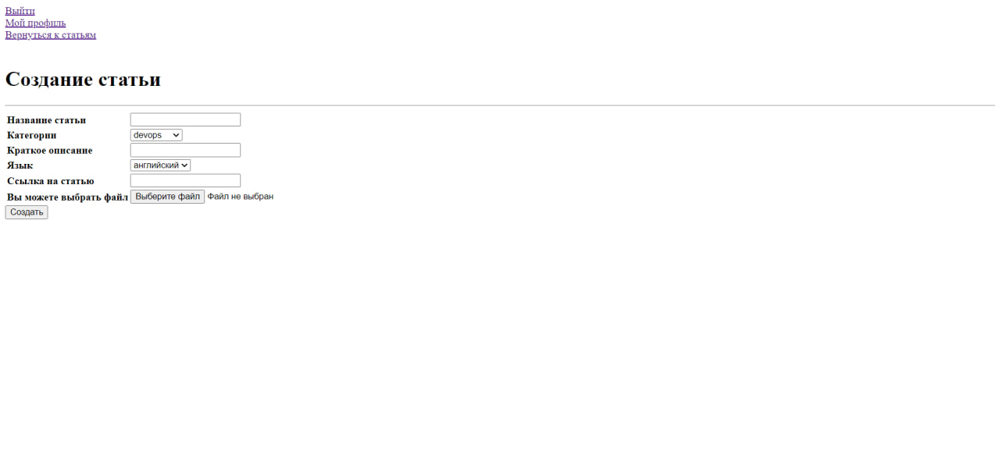
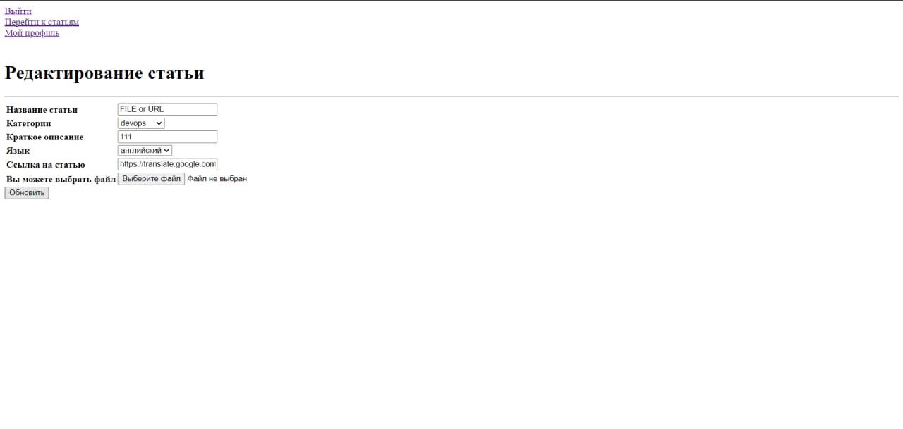

# Требования к проекту
---

# Содержание
1 [Введение](#intro)  
1.1 [Назначение](#appointment)  
1.2 [Бизнес-требования](#business_requirements)  
1.2.1 [Исходные данные](#initial_data)  
1.2.2 [Возможности бизнеса](#business_opportunities)  
1.2.3 [Границы проекта](#project_boundary)  
1.3 [Аналоги](#analogues)  
1.3.1 [Отличия от аналогов](#analogues_differences)  
2 [Требования пользователя](#user_requirements)  
2.1 [Программные интерфейсы](#software_interfaces)  
2.2 [Интерфейс пользователя](#user_interface)  
2.3 [Характеристики пользователей](#user_specifications)  
2.3.1 [Классы пользователей](#user_classes)  
2.3.2 [Аудитория приложения](#application_audience)  
2.3.2.1 [Целевая аудитория](#target_audience)  
2.4 [Предположения и зависимости](#assumptions_and_dependencies)  
3 [Системные требования](#system_requirements)  
3.1 [Функциональные требования](#functional_requirements)  
3.1.1 [Основные функции](#main_functions)  
3.1.1.1 [Отображения списка статей на главной странице](#show_list_of_articles)  
3.1.1.2 [Обновление списка статей](#update_list_of_articles)  
3.1.1.3 [Фильтрация списка статей по всем её характеристикам](#filtration_list_of_articles)  
3.1.1.4 [Вход на страницу своего профиля](#enter_profile)  
3.1.1.5 [Создание статьи](#create_article)
3.1.1.6 [Редактирование статьи](#update_article)
3.1.1.7 [Выход из профиля](#exit) 
3.1.2 [Ограничения и исключения](#restrictions_and_exclusions)  
3.2 [Нефункциональные требования](#non-functional_requirements)  
3.2.1 [Атрибуты качества](#quality_attributes)  
3.2.1.1 [Требования к удобству использования](#requirements_for_ease_of_use)  
3.2.2 [Внешние интерфейсы](#external_interfaces)  
3.2.3 [Ограничения](#restrictions)  
3.3 [Расширение функционала приложения](#extensions)  
3.3.1 [Выбор темы](#extensions_dark_mode)  
3.3.2 [Ограничение доступа к завершению выполнения процесса](#extensions_restrictions)  
3.3.3 [Сохранение списка процессов и загруженности системы в файл](#extensions_save_to_file)  

<a name="intro"/>

# 1 Введение

<a name="appointment"/>

## 1.1 Назначение
Документ разработан для однозначной трактовки требований между разработчиком и заказчиком. Необходимо разработать web-приложение, которое позволит читать, добавлять статьи о IT-сфере на сайте.

В этом документе описаны функциональные и нефункциональные требования к web-приложению «NoHabr Articles». Этот документ предназначен для команды, которая будет реализовывать и проверять корректность работы приложения. 

<a name="business_requirements"/>

## 1.2 Бизнес-требования

<a name="initial_data"/>

### 1.2.1 Исходные данные
На просторах интернета существует много форумов и блогов, в которых публикуются статьи разного характера и о разных сферах жизни. Однако ресурсов, где публикуется множество статей из мира IT, не так много, как хотелось бы. Некоторые из этих площадок довольно сложны для взаимодействия и пользователю приходится проделать множество шагов для создания или нахождения нужной статьи.

<a name="business_opportunities"/>

### 1.2.2 Возможности бизнеса
При поиске нужных статей на разных платформах из многочисленного текста статьи сложно сразу понять, то ли это, что нужно, поэтому пользователи не всегда могут быть удовлетворены полученной информацией из статьи, но при этом потратить много времени на её прочтение. Приложение "NoHabr Articles" предоставляет возможность понимания, о чем статья, на этапе прочтения краткого описания. Пользователь, который нашел достойную статью о какой-либо IT-технологии на просторах интернета, может создать карточку статьи на "NoHabr Articles" с кратким описанием, чем полезна статья, указанием технологии и языка, на котором написана статья. Таким образом данная платформа повысит качество поиска иинформации, так как в приложении "NoHabr Articles" будут находится статьи, рекомендованные другими соискателями.

<a name="project_boundary"/>

### 1.2.3 Границы проекта
Приложение «NoHabr Articles» требует регистрации. Для возможности использования функционала приложения необходима обязательная авторизация. После авторизации приложение предоставит пользователю доступ к краткому описанию всех статей со ссылкой на источник или прикрепленный файл. Так же пользователь сможет просмотреть свои статьи, создать новую статью.

<a name="analogues"/>

## 1.3 Аналоги
Одним из самых крупных аналогов сервиса для публикации статей является платформа Habr, которая позволяет публиковать свои статьи пользователям, а так же для удобства поиска оставлять теги в конце каждой статьи.
Диспетчер задач Windows позволяет получить информацию об исполняемых процессах, задействованных операционной системой мощностных ресурсах, управлять автозагрузкой приложений и отслеживать
их активность.
Англоязычный ресурс Engadget — блог о технологиях, публикующий новости о гаджетах и потребительской электронике.

<a name="analogues_differences"/>

## 1.3.1 Отличия от аналогов
В отличие от остальных сайтов для публикации и чтения статей о IT-сфере, приложение "NoHabr Articles" будет иметь только ссылки или файлы на уже проверенные статьи с просторов интернета. Таким образом данное web-приложение призвано для отбора полезных статей из всего интернета, которое не ограничивается одним или несколькими ресурсами, а так же предлагает довольно гибкую систему фильтрации статей.

<a name="user_requirements"/>

# 2 Требования пользователя

<a name="software_interfaces"/>

## 2.1 Программные интерфейсы
Продукт должен являться кроссплатформенным web-приложением и иметь user-friendly интерфейс. Приложение должно быть реализовано на языке Python с помощью фреймворка FastAPI, в качетсве хранилища данных и работы с ними использовать PostgreSQL.

<a name="user_interface"/>

## 2.2 Интерфейс пользователя
Страница регистрации.  

Страница входа.  
  

Главная страница.  
 

Страница профиля.  
 

Страница создания статьи.  
 

Страница редактирования статьи.  
 

<a name="user_specifications"/>

## 2.3 Характеристики пользователей

<a name="user_classes"/>

### 2.3.1 Классы пользователей

Приложение требует обязательной авторизации для пользования сервисом.

<a name="application_audience"/>

### 2.3.2 Аудитория приложения

<a name="target_audience"/>

#### 2.3.2.1 Целевая аудитория
Пользователи, желающие сократить время поиска нужной информации, желающие просматривать только отобранные статьи.

<a name="assumptions_and_dependencies"/>

## 2.4 Предположения и зависимости
1. Приложение работает только с подключенным интернетом.

<a name="system_requirements"/>

# 3 Системные требования

<a name="functional_requirements"/>

## 3.1 Функциональные требования

<a name="main_functions"/>

### 3.1.1 Основные функции

<a name="show_list_of_articles"/>

#### 3.1.1.1 Отображения списка статей на главной странице
**Описание.** Пользователь имеет возможность просматривать все статьи на главной странице.

**Требование.** После входа в приложение пользователь попадает на главную страницу приложения, на которой находятся все статьи всех пользователей сервиса. Пользователь может листать страницу и переходить по ссылке на в описании статьи, либо же скачивать файл.

<a name="update_list_of_articles"/>

#### 3.1.1.2 Обновление списка статей
**Описание.** Пользователь имеет возможность актуализировать информацию.

**Требование.** Приложение должно дать пользователю возможность в любой момент обновить список статей на странице.

<a name="filtration_list_of_articles"/>

#### 3.1.1.3 Фильтрация списка статей по всем её характеристикам
**Описание.** Пользователь имеет возможность получить отфильтровать статьи по одному или нескольким характеристикам для удобства поиска нужной статьи.

**Требование.** Приложение должно дать пользователю возможность в любой момент провести фильтрацию статей по названию, категории, технологии, языку и автору.

<a name="enter_profile"/>

#### 3.1.1.4 Вход на страницу своего профиля
**Описание.** Пользователь имеет возможность в любой момент зайти на страницу своего профиля.

**Требование.** Приложение должно дать пользователю перейти на страницу своего профиля, где будут отображаться все написанные им статьи.

<a name="create_article"/>

#### 3.1.1.5 Создание статьи
**Описание.** Пользователь имеет возможность создать новую статью.

**Требование.** Приложение должно дать пользователю возможность создания новой статьи при переходе на страницу "Создание статьи".

<a name="update_article"/>

#### 3.1.1.6 Редактирование статьи
**Описание.** Пользователь имеет возможность редактировать написанную им статью.

**Требование.** Приложение должно дать пользователю возможность редактирования созданной им статьи при переходе на страницу "Редактирование статьи".

<a name="exit"/>

#### 3.1.1.7 Выход из профиля
**Описание.** Пользователь имеет возможность выйти из своего профиля.

**Требование.** Приложение должно дать пользователю возможность в любой момент времени выйти из своего профиля.

<a name="restrictions_and_exclusions"/>

### 3.1.2 Ограничения и исключения
1. Приложение работает только с подключенным интернетом.

<a name="non-functional_requirements"/>

## 3.2 Нефункциональные требования

<a name="quality_attributes"/>

### 3.2.1 Атрибуты качества

<a name="requirements_for_ease_of_use"/>

#### 3.2.1.1 Требования к удобству использования
1. Доступ к основным функциям приложения не более чем за две операции;
2. Все функциональные элементы пользовательского интерфейса имеют названия, описывающие действие, которое произойдет при нажатии или вводе данных;
3. Обновление информации о добавленных статьях осуществляется с помощью перезагрузки страницы браузера.
4. Понятный интерфейс.

<a name="restrictions"/>

### 3.2.2 Ограничения
1. Дизайн должен соответствовать пункту интерфейс пользователя.

<a name="extensions"/>

## 3.3 Расширение функционала приложения

<a name="extensions_dark_mode"/>

### 3.3.1 Возмоность редактирования статьи
Функционал приложения позволяет пользователю добавлять статьи, однако при возможной ошибке пользователя в заполнении информации о статье, пользователь не будет иметь возможность редактировать статью в целях испавления ошибки или обновления информации.

<a name="extensions_restrictions"/>

### 3.3.2 Возможность удаления статьи
В случае, когда статья имеет большое содержание неактуальной и устаревшей информации, пользователь должен иметь возможность удаления своей статьи.
